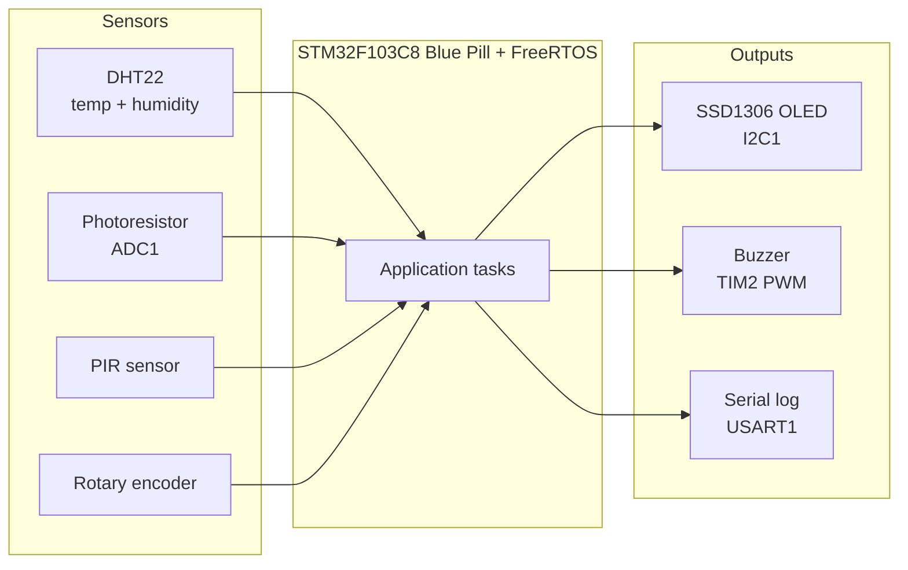
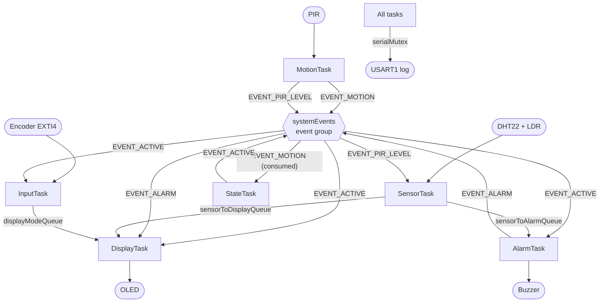
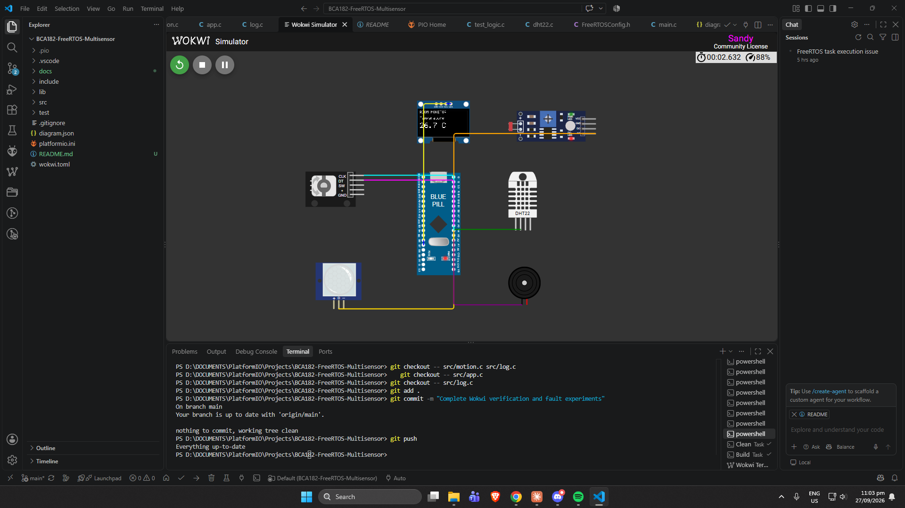
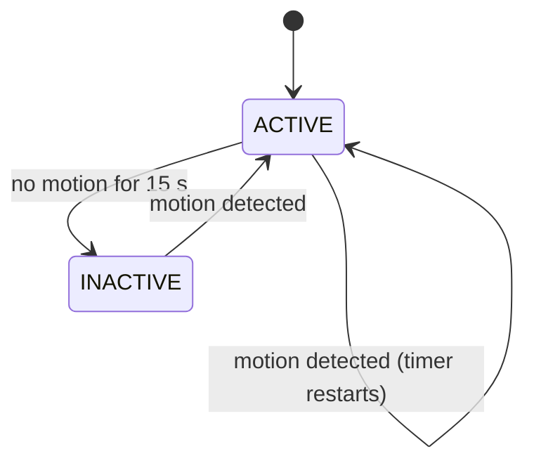
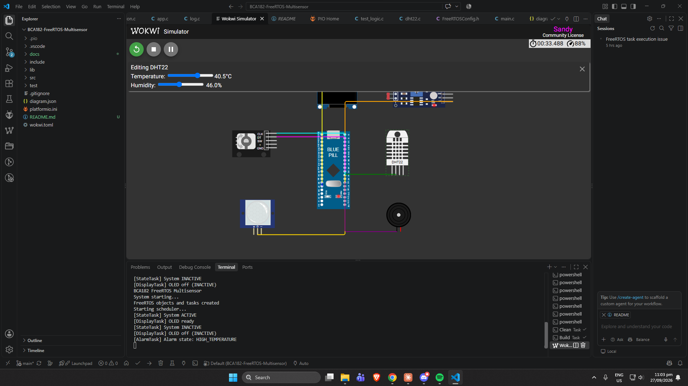

# FreeRTOS Room Multisensor on STM32 Blue Pill (Wokwi)

A simulated room-monitoring system built on an **STM32F103C8 (Blue Pill)** with **PlatformIO**, the **STM32Cube HAL**, and **native FreeRTOS APIs**. Six concurrent tasks measure temperature, humidity, ambient light, and motion. They show one selected reading on an OLED, sound a buzzer when the temperature leaves its safe range, and put the system to sleep when the room is empty.

> Developed for BCA182 Embedded Systems Programming, Laboratory Activity No. 1 (MSU-IIT). The complete system runs in the [Wokwi](https://wokwi.com) simulator.

---

## Project Overview

The device monitors a room and reacts to it:

- **Measures** temperature and humidity (DHT22) and relative ambient light (photoresistor) every 2 seconds.
- **Displays** one measurement at a time on an SSD1306 OLED. A rotary encoder switches pages.
- **Alarms** with a buzzer when the temperature is below **18 °C** or above **30 °C**.
- **Saves activity** with an ACTIVE/INACTIVE state machine. After **15 s** with no motion (PIR), the OLED turns off and input and the alarm are disabled. The next motion wakes the system.

Each responsibility runs in its own FreeRTOS task. Data moves through **queues**, system state is signalled through an **event group**, and the shared serial port is protected by a **mutex**.

## Features

- DHT22 temperature and humidity acquisition (single-wire protocol, microsecond timing with the DWT cycle counter)
- Photoresistor reading through ADC1, reported as a relative 0–100 % light level
- PIR motion monitoring
- SSD1306 128×64 OLED over I2C with a small built-in 5×7 font
- Rotary encoder navigation (interrupt-driven, with wraparound)
- Temperature alarm with a 1 kHz PWM buzzer tone
- ACTIVE/INACTIVE state machine with a 15 s inactivity timeout
- Six FreeRTOS tasks with justified priorities
- 3 queues, 1 event group, 1 recursive mutex, `vTaskDelayUntil()` periodic sampling
- Hardware-independent decision logic covered by **13 unit tests**
- Static analysis with cppcheck (`pio check`): **0 high / 0 medium** findings

## Learning Objectives

This project demonstrates how to:

- structure an STM32 application as cooperating FreeRTOS tasks instead of one super-loop;
- choose task priorities based on response-time requirements;
- use queues, an event group, and a mutex, each for a real purpose;
- implement drift-free periodic sampling with `vTaskDelayUntil()`;
- separate pure decision logic from hardware drivers so it can be unit-tested on a PC;
- verify firmware with unit tests, simulator functional tests, deliberate fault experiments, and static analysis;
- debug an RTOS port at the exception/context-switch level (see [Engineering Decisions](#engineering-decisions)).

## System Architecture



*Figure 1. System architecture: four inputs, one STM32F103C8 running FreeRTOS, three outputs.*

## FreeRTOS Architecture



*Figure 2. Task communication: queues carry data, the event group carries system state and events, and the mutex protects the shared serial port.*

## Hardware / Simulated Components

| Component | Purpose |
|---|---|
| STM32 Blue Pill (STM32F103C8, Cortex-M3) | Main microcontroller |
| DHT22 | Temperature and humidity |
| Photoresistor sensor module | Relative ambient light |
| PIR motion sensor | Motion detection |
| KY-040 rotary encoder | Page navigation |
| SSD1306 128×64 OLED (I2C, 0x3C) | Display |
| Passive buzzer | Temperature alarm |



*Figure 3. Wokwi circuit with the Blue Pill and all simulated components.*

## Pin Configuration

| Signal | STM32 pin | Peripheral / mode |
|---|---|---|
| Photoresistor AO | PA0 | ADC1_IN0, analog |
| DHT22 DATA | PA1 | GPIO, output for the start pulse, then input with pull-up |
| Buzzer | PA2 | TIM2_CH3, 1 kHz PWM |
| PIR OUT | PA3 | GPIO input, pull-down |
| Encoder CLK | PA4 | EXTI4, falling-edge interrupt |
| Encoder DT | PA5 | GPIO input, pull-up |
| Serial TX / RX | PA9 / PA10 | USART1, 115200 8N1 |
| OLED SCL / SDA | PB6 / PB7 | I2C1, 400 kHz |
| Status LED | PC13 | GPIO output (fault indicator) |

Timers: **TIM2** buzzer PWM, **TIM3** FreeRTOS tick (Wokwi port), **TIM4** HAL timebase.

## Task Design

| Task | Responsibility | Trigger / period | Priority | IPC | Typically blocked on |
|---|---|---|:-:|---|---|
| MotionTask | Poll PIR, signal motion | 100 ms | 3 | Event group (sets `EVENT_MOTION`, `EVENT_PIR_LEVEL`) | `vTaskDelay()` |
| InputTask | Encoder steps → selected page | 50 ms + EXTI4 ISR counter | 3 | `displayModeQueue`, reads `EVENT_ACTIVE` | `vTaskDelay()` |
| StateTask | ACTIVE/INACTIVE state machine | Motion event or 250 ms | 3 | Waits on `EVENT_MOTION`, sets/clears `EVENT_ACTIVE` | `xEventGroupWaitBits()` |
| SensorTask | Read DHT22 + LDR | 2 s, `vTaskDelayUntil()` | 2 | Writes both sensor queues | `vTaskDelayUntil()` |
| AlarmTask | Evaluate temperature, drive buzzer | New reading or 250 ms | 2 | `sensorToAlarmQueue`, sets/clears `EVENT_ALARM` | `xQueueReceive()` |
| DisplayTask | Sole owner of the OLED | New data/page or 100 ms | 1 | `sensorToDisplayQueue`, `displayModeQueue`, event group | `xQueueReceive()` / `xEventGroupWaitBits()` |

**Why these priorities:** MotionTask, InputTask, and StateTask react to people. A missed or late motion event means the system does not wake up, and a slow encoder feels broken, so they get the highest priority (3). SensorTask and AlarmTask work on a 2 s cadence where a few milliseconds of delay has no visible effect (2). DisplayTask performs the longest operation (a full-frame I2C transfer) and is the least time-critical, so it has the lowest priority (1). This keeps a redraw from delaying user input.

## Inter-Task Communication

### Queues (length 1, `xQueueOverwrite`)

| Queue | Producer → Consumer | Item |
|---|---|---|
| `sensorToDisplayQueue` | SensorTask → DisplayTask | `SensorData` |
| `sensorToAlarmQueue` | SensorTask → AlarmTask | `SensorData` |
| `displayModeQueue` | InputTask → DisplayTask | `DisplayMode` |

Each queue holds only the **newest** value, so a consumer never processes a backlog of stale readings. Two sensor queues are used because receiving from a queue removes the item, and one consumer must not take data the other still needs.

### Event group `systemEvents`

| Bit | Name | Set / cleared by | Read by | Meaning |
|:-:|---|---|---|---|
| 0 | `EVENT_ACTIVE` | StateTask | DisplayTask, InputTask, AlarmTask | System is ACTIVE |
| 1 | `EVENT_MOTION` | Set by MotionTask; cleared by StateTask on read | StateTask | A motion event occurred |
| 2 | `EVENT_ALARM` | AlarmTask | DisplayTask | Temperature alarm active |
| 3 | `EVENT_PIR_LEVEL` | MotionTask | SensorTask | Current PIR output level |

### Mutex `serialMutex`

A **recursive** mutex protects USART1, which all six tasks use for diagnostics. `Log_Begin()`/`Log_End()` hold it across a multi-part line so another task cannot print in the middle of it. The mutex's priority inheritance prevents a low-priority logger from blocking a high-priority task for long.

## State Machine



*Figure 4. ACTIVE/INACTIVE state machine, implemented as the pure function `evaluateSystemState()`.*

| State | Behavior |
|---|---|
| **ACTIVE** | OLED on, sensor processing, encoder enabled, alarm enabled |
| **INACTIVE** | OLED off and DisplayTask **blocked** on `EVENT_ACTIVE` (no display work), encoder ignored, buzzer silenced, motion detection keeps running |

## Repository Structure

```
bca182-freertos-multisensor/
├── include/                  Headers (+ FreeRTOSConfig.h, CubeMX HAL config)
│   ├── app.h  alarm.h  buzzer.h  dht22.h  display.h  input.h  ldr.h
│   ├── log.h  logic.h  motion.h  rtos_objects.h  sensors.h  ssd1306.h
│   └── system_state.h
├── src/
│   ├── main.c                Hardware init → app_main()
│   ├── app.c                 RTOS objects + task creation, scheduler start
│   ├── sensors.c  display.c  input.c  alarm.c  motion.c  system_state.c   (tasks)
│   ├── dht22.c  ldr.c  ssd1306.c  buzzer.c  log.c                          (drivers)
│   ├── logic.c               Pure decision logic (unit-tested)
│   ├── rtos_objects.c  rtos_hooks.c
│   └── stm32f1xx_*.c         CubeMX-generated MSP / IRQ / TIM4 timebase
├── lib/FreeRTOS/             FreeRTOS V10.3.1 + Wokwi compatibility port
├── test/test_logic/          13 Unity unit tests (run on the PC)
├── docs/                     Report, static-analysis and test outputs, images
├── platformio.ini
├── diagram.json              Wokwi circuit
└── wokwi.toml
```

## Getting Started

Requirements:

- Visual Studio Code with the **PlatformIO IDE** extension
- **Wokwi Simulator** extension for VS Code (a free community license is enough)
- For unit tests on Windows: a host C compiler, e.g. `winget install BrechtSanders.WinLibs.POSIX.UCRT`

```bash
git clone https://github.com/monxx-ie/BCA182-freetos-multisensor.git
cd BCA182-freetos-multisensor
```

Open the folder in VS Code. PlatformIO installs the STM32 platform on first build.

## Building the Project

```bash
pio run -e bluepill_f103c8
```

The build must end with `SUCCESS`. Typical usage: RAM ≈ 59 %, Flash ≈ 30 %.

## Running the Wokwi Simulation

1. Build the firmware.
2. In VS Code: **F1 → Wokwi: Start Simulator**.
3. Expected serial output:

```
BCA182 FreeRTOS Multisensor
System starting...
FreeRTOS objects and tasks created
Starting scheduler...
[StateTask] System ACTIVE
[DisplayTask] OLED ready
```

4. Interact: click the DHT22 / photoresistor to change values, use the encoder arrows to change pages, and click the PIR → *Simulate motion*.



*Figure 5. Running system: OLED showing the temperature page with the alarm indicator, serial log of task activity.*

## Unit Testing

```bash
pio test -e native
```

13 tests run on the PC against the hardware-independent logic in `src/logic.c`:

| Area | Tests |
|---|---|
| `evaluateTemperature()` | below 18 °C, exactly 18 °C, 25 °C, exactly 30 °C, above 30 °C |
| `nextDisplayMode()` / `previousDisplayMode()` | forward, forward wraparound, reverse, reverse wraparound |
| `evaluateSystemState()` | ACTIVE/no timeout, ACTIVE/timeout, INACTIVE/no motion, INACTIVE/motion |

Result: **13 / 13 passed** (`docs/unit-test-results.txt`).

## Static Code Analysis

```bash
pio check -e bluepill_f103c8
```

| Run | High | Medium | Low |
|---|:-:|:-:|:-:|
| Initial (`docs/pio-check-report.txt`) | 0 | 0 | 58 |
| Final (`docs/pio-check-report-after.txt`) | 0 | 0 | 6 |

- **51 × `unusedFunction`**: false positives. cppcheck analyzes files separately and cannot see calls made through function pointers (`xTaskCreate`), the interrupt vector table, or HAL/FreeRTOS callbacks. Suppressed in `platformio.ini`, with this justification.
- **1 × `unsignedLessThanZero`** (`dht22.c`): the code was restructured, the warning followed the expression, and it was confirmed as a false positive on a wrap-safe elapsed-time comparison. Suppressed inline with a justification.
- **6 × `constParameterPointer`**: remaining on FreeRTOS/HAL callback signatures (`vApplicationStackOverflowHook`, `HAL_*_MspInit`) that must match their API declarations and cannot be changed.

## Functional Verification

All ten functional tests pass in Wokwi:

| ID | Stimulus | Observed result | Result |
|---|---|---|:-:|
| FT-01 | Change DHT22 temperature | OLED and log follow the new value (e.g. 25.0 → 43.7 → 58.6 °C) | PASS |
| FT-02 | Change DHT22 humidity | Humidity page follows (e.g. 50.0 → 73.0 → 56.5 %) | PASS |
| FT-03 | Change photoresistor lux | Light level changes (75 % → 95 % → 99 %); brighter = higher | PASS |
| FT-04 | Rotate encoder clockwise | Temperature → Humidity → Light → Motion → Temperature | PASS |
| FT-05 | Rotate encoder counterclockwise | Temperature → Motion (wraparound) → Light … | PASS |
| FT-06 | Temperature above 30 °C | `Alarm state: HIGH_TEMPERATURE`, buzzer on, "! TEMP ALARM" on OLED | PASS |
| FT-07 | Temperature back to normal (24.6 °C) | `Alarm state: NORMAL`, buzzer off | PASS |
| FT-08 | Trigger PIR while ACTIVE | `Motion detected`, system stays ACTIVE, timeout restarts | PASS |
| FT-09 | No motion for 15 s | `System INACTIVE`, OLED off | PASS |
| FT-10 | Trigger PIR while INACTIVE | `System ACTIVE`, `OLED on (ACTIVE)` | PASS |

Three deliberate fault experiments (blocking removed, priority inflated, mutex removed) are documented in the laboratory report (`docs/laboratory-report.pdf`).

## Engineering Decisions

- **`vTaskDelayUntil()` for sampling.** SensorTask wakes at fixed 2 s instants measured from the previous wake time, so the time spent reading sensors does not accumulate as drift, as it would with `vTaskDelay()`.
- **Latest-value queues.** Length-1 queues with `xQueueOverwrite()` give consumers the newest reading and avoid stale backlogs.
- **Single OLED owner.** Only DisplayTask touches I2C1 and the frame buffer, so no display locking is needed.
- **Tiny ISR.** The encoder ISR only increments or decrements a counter. InputTask reads and clears it atomically inside a critical section. No FreeRTOS calls are made from interrupt context.
- **Pure logic module.** `logic.c` contains no HAL or FreeRTOS code, so alarm, navigation, and state decisions can be unit-tested on a PC.
- **HAL timebase on TIM4.** SysTick is left to the RTOS (HAL and FreeRTOS both want a tick source); the CubeMX-generated TIM4 timebase feeds `HAL_GetTick()`.
- **Microsecond timing with DWT.** The DHT22 protocol uses the Cortex-M cycle counter instead of a hardware timer, with bounded, never-infinite wait loops.

### Running FreeRTOS in Wokwi (simulator compatibility)

The standard FreeRTOS Cortex-M ports did not run in the Wokwi STM32F103 model. They were debugged with `configASSERT` and a fault reporter that prints over the UART:

1. **ARM_CM3 port**: assert at `port.c:336`. The simulated NVIC does not implement interrupt priority bits (they read back as 0), so BASEPRI-based masking cannot work.
2. **FreeRTOS V11 ARM_CM0 port**: assert at `port.c:901`. The first-task SVC call's number is not recovered correctly from the exception frame.
3. **V10.6.2 ARM_CM0 port**: tasks started, but resuming any task saved by an interrupt-driven (PendSV) context switch locked the simulated CPU.

The final build uses a **Wokwi compatibility port** of FreeRTOS V10.3.1 (adapted from a classmate's work, see acknowledgments). It uses TIM3 as the tick source and performs context switches from Thread mode instead of SysTick/SVC/PendSV. Two further defects found during this project were fixed in that port:

- **Interrupt masking** was changed from BASEPRI to **PRIMASK** (`cpsid i` / `cpsie i`), because BASEPRI has no effect in the simulator. Without this, the tick ISR could interrupt kernel critical sections (observed as random lockups).
- **Critical-section nesting** is now **saved per task** in the context frame. FreeRTOS may yield inside a critical section, and a shared counter left interrupts permanently disabled after such a switch (observed as the whole system freezing).

## Limitations

- The scheduling port is **simulator-specific**. The tick does not preempt a running task; switches happen at blocking calls and from the idle hook, with a 20 Hz tick (50 ms resolution). On real hardware, the standard `ARM_CM3` port should be used.
- The light level is a relative ADC-based percentage, **not calibrated lux**.
- The 15 s inactivity timeout is intentionally short for testing.
- The DHT22 read holds interrupts off for about 5 ms, and the first read after power-up may fail while the sensor settles.
- No FreeRTOS `FromISR` APIs are used, since the compatibility port does not support switching from interrupt context.

## Future Improvements

- Validate on a physical Blue Pill with the standard `ARM_CM3` port and a 1 kHz tick.
- Drive the encoder with a task notification from the ISR (on hardware), removing the 50 ms polling.
- Interrupt- or DMA-driven UART logging.
- Calibrate the light sensor to lux.
- Show more status on the OLED (state, alarm type, uptime) and add a beep pattern instead of a continuous tone.

## References and Acknowledgments

- BCA182 Laboratory Activity No. 1 specification, Asst. Prof. Paul Rodolf P. Castor, MSU-IIT
- [FreeRTOS Kernel](https://github.com/FreeRTOS/FreeRTOS-Kernel) (MIT license): V10.3.1 kernel sources
- **Wokwi compatibility port** (`lib/FreeRTOS/portable/GCC/ARM_CM3`) adapted from **Ni-ear**, [bca182-freertos-multisensor](https://github.com/Ni-ear/bca182-freertos-multisensor); PRIMASK masking and per-task critical-nesting fixes added in this project
- STMicroelectronics STM32CubeF1 HAL and STM32CubeMX (HAL configuration, MSP and TIM4 timebase files)
- PlatformIO ststm32 platform, Unity test framework, cppcheck
- Wokwi simulator and its STM32 Blue Pill model
- Classic public 5×7 ASCII font used in the SSD1306 driver
